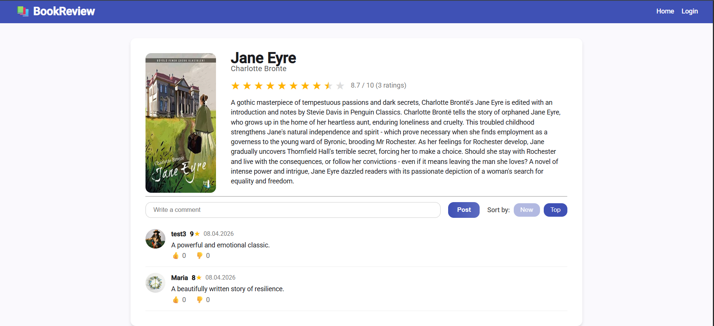

# Bookreview
BookReview is a web application for viewing books, assigning ratings, and writing comments. Users can rate books, discuss them in comments, and view other users ratings.

## Screenshots

## Screenshots

  
Admin panel

  
  
  

## 🛠️ Technologies
- Java 21
- Spring Boot, Spring Security, Spring Data JPA, Spring MVC 
- Angular
- JWT
- MySQL
- Docker

## 🧑‍💻 Features
- User:
  - Register and log in
  - Browse books
  - View book pages
  - Rate books
  - Write comments
  - Like / dislike comments
  - View and edit personal profile
  - View other users profiles
- Admin:
  - Create books
  - Edit books
  - Delete books
  - Delete any comment
  - Block / unblock users

## ⚙️ Running the Project
- Backend:
  - cd backend
  - ./mvnw spring-boot:run
- Frontend:
  - cd frontend
  - npm install
  - ng serve
- Docker:
  - cd backend
  - docker compose up --build
